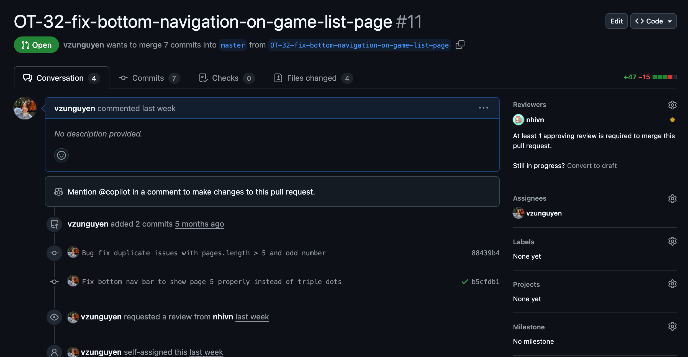
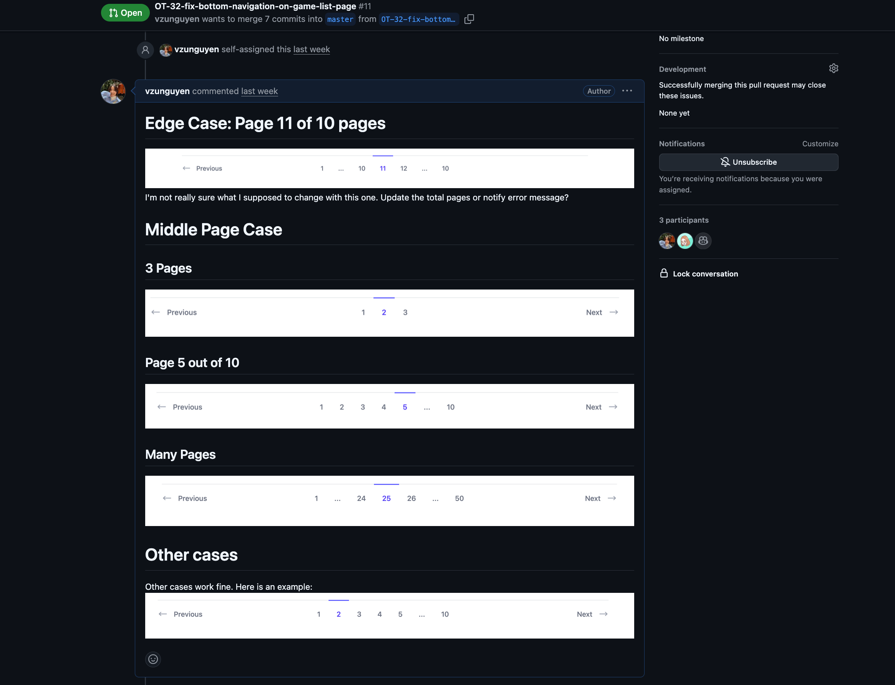

# Introduction
Otome Tracker is a web application designed to help users track and manage their otome games, routes, and user reviews. Built with React and TypeScript, it offers a seamless experience for otome enthusiasts to organize their gaming journey.
# Technologies Used
- **React**: For building the user interface.
- **TypeScript**: To ensure type safety and improve code quality.
- **Tailwind CSS**: For styling and responsive design.
- **Storybook**: For testing UI components.
# What I learned
## Git Pull Requests and Code Reviews

During the development of Otome Tracker, I actively engaged in creating Git pull requests. This experience helped me gain insights into collaborative coding practices and the importance of code reviews.
I have also learned how to open pull request, write proper comments and feedbacks during this process.

