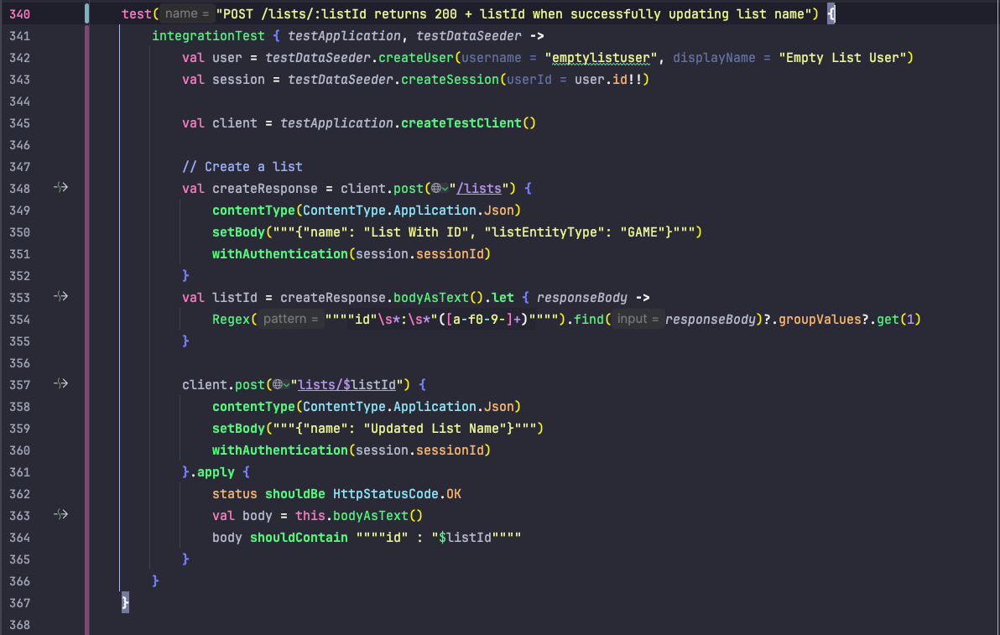
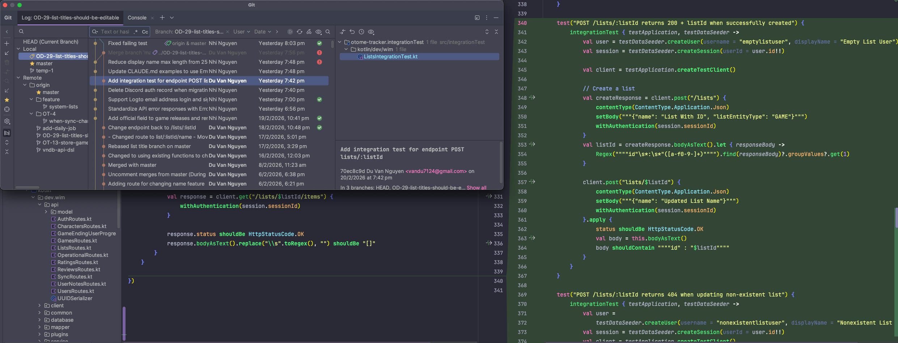

# Introduction
Otome Tracker is a web application designed to help users track and manage their otome games, routes, and user reviews. Built with React and TypeScript, it offers a seamless experience for otome enthusiasts to organize their gaming journey.
# Technologies Used
- **Docker**: For running the application in a containerised environment, ensuring consistency across different development and production setups.
- **Kotlin**: For building the backend API.
- **PostgreSQL**: For storing user data.
- **Flyway Migration**: For managing database schema changes.
- **Swagger UI**: For documenting the API endpoints.
- For testing backend: **Kotest** and **MockK**.
- **React**: For building the user interface.
- **TypeScript**: To ensure type safety and improve code quality.
- **Tailwind CSS**: For styling and responsive design.
- **Storybook**: For testing UI components.
# What I learned
## Git Pull Requests and Code Reviews

During the development of Otome Tracker, I actively engaged in creating Git pull requests. This experience helped me gain insights into collaborative coding practices and the importance of code reviews.
I have also learned how to open pull request, write proper comments and feedbacks during this process.

## Writing Tests (Integration Tests, Unit Tests, Mocks) with MockK, Kotest
### Integration Tests
During an end-to-end feature development, I wrote integration tests for the backend API endpoints, ensuring that they functioned correctly and returned expected responses (HTTP status codes, JSON payloads, etc.).

This is the evidence of my commitment to writing tests for my code.

### Unit Tests and Mocks
Before implementing API endpoints, I wrote unit tests for the logic behind small functions to ensure that they functioned as expected.

