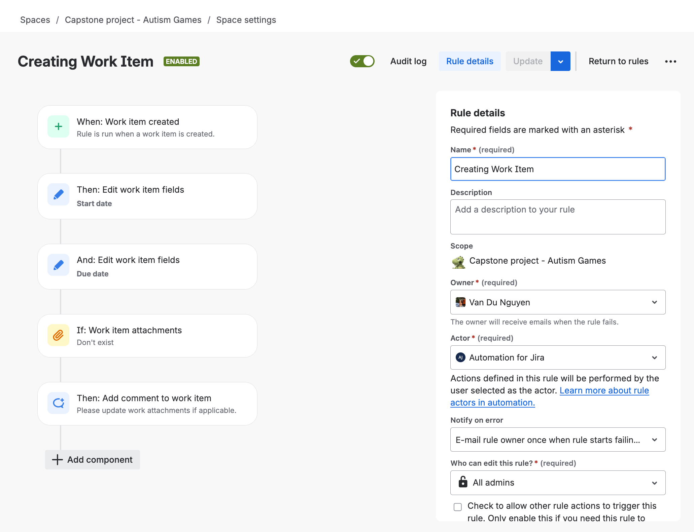
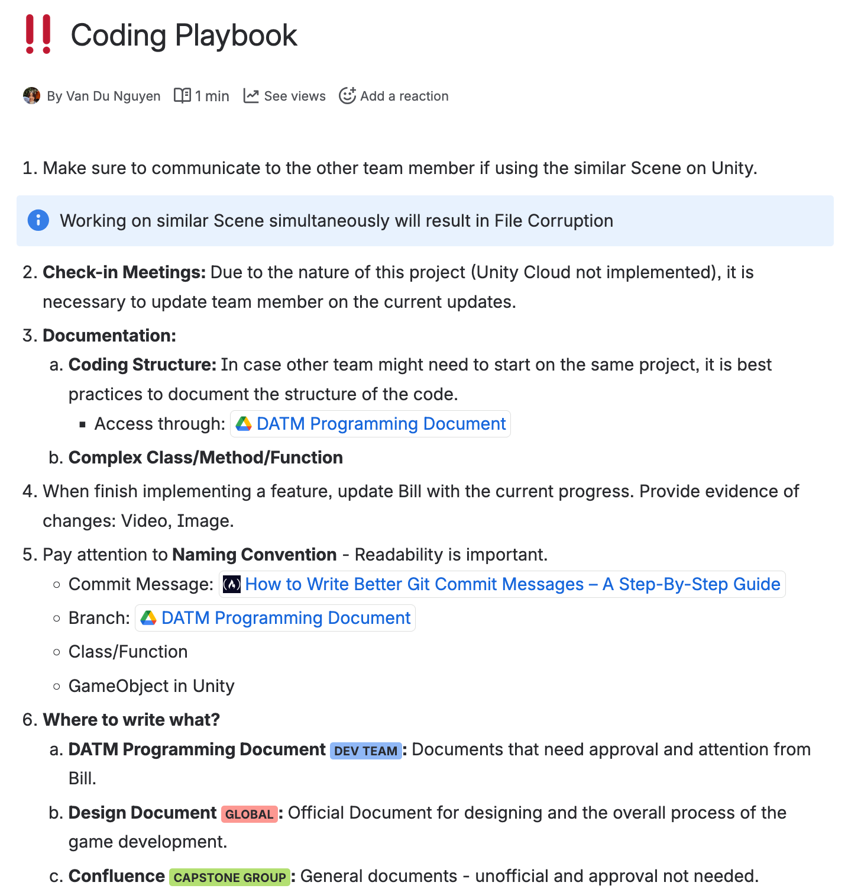

# Introduction
Day At The Market is a 3D adventure game developed using Unity and C#. The game
offers players an immersive experience as they navigate through a bustling market, completing various quests and interacting with NPCs.
# Development Process
The development of Day At The Market spanned over a year, during which I worked as an intern at Educational Network Group. The project involved several key stages:
- **Conceptualization**: Brainstorming game ideas, mechanics, and storyline.
- **Design**: Creating 3D models, textures, and animations for characters and environments.
- **Implementation**: Coding game mechanics, player controls, and NPC interactions using C# in Unity.
- **Testing**: Conducting playtests to identify and fix bugs, and improve gameplay experience.
- **Polishing**: Refining graphics, sound effects, and overall user experience.
# Technologies Used
- **Unity**: The primary game engine used for developing the game, providing tools for 3D rendering, physics, and animation.
- **C#**: The programming language used for scripting game mechanics and interactions within Unity.
# My Journey (Problems we faced and what I learned)
## Planning and Documentation
It was fundamental for us to plan out the tasks for each sprint (for this project, each sprint was 3 weeks long).
To fully utilised Jira and Confluence, we jumped in learning how to use these tools effectively for project management and documentation.

### Jira Automation
During this project, I gained interest with learning how to effectively use project management tools. I was playing around with Jira Automation Function where whenever I was creating a ticket/task, it will perform pre-defined actions such as assigning the task to a specific person, setting due dates based on the sprint end date, and adding labels based on the task type.

### Confluence for Documentation
We used Confluence for documenting our project requirements, design decisions, and meeting notes. Any final documentation such as game design document or coding guidelines for new developers were written in Google Docs due to the client preference.

## Agile Methodology
We adopted Agile practices, conducting regular stand-up meetings, sprint planning, and retrospectives. This approach allowed us to adapt to changes quickly and continuously improve our development process.

### Weekly Stand-ups
We held weekly stand-up meetings with both our supervisor and the client to discuss progress, roadblocks, and plans for the week. This ensured everyone was aligned and any issues were addressed promptly.

### Sprint Planning

### Sprint Review
At the end of each sprint, we held sprint review meetings to showcase the completed features to stakeholders and gather feedback. This feedback was invaluable in refining the game and ensuring it met user expectations.

### Retrospective
For retrospectives, we discussed what went well, what could be improved, and action items for the next sprint. This was mentioned in our Sprint Reports at the end of each sprint.