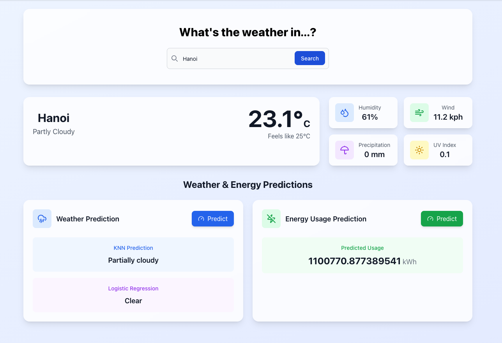
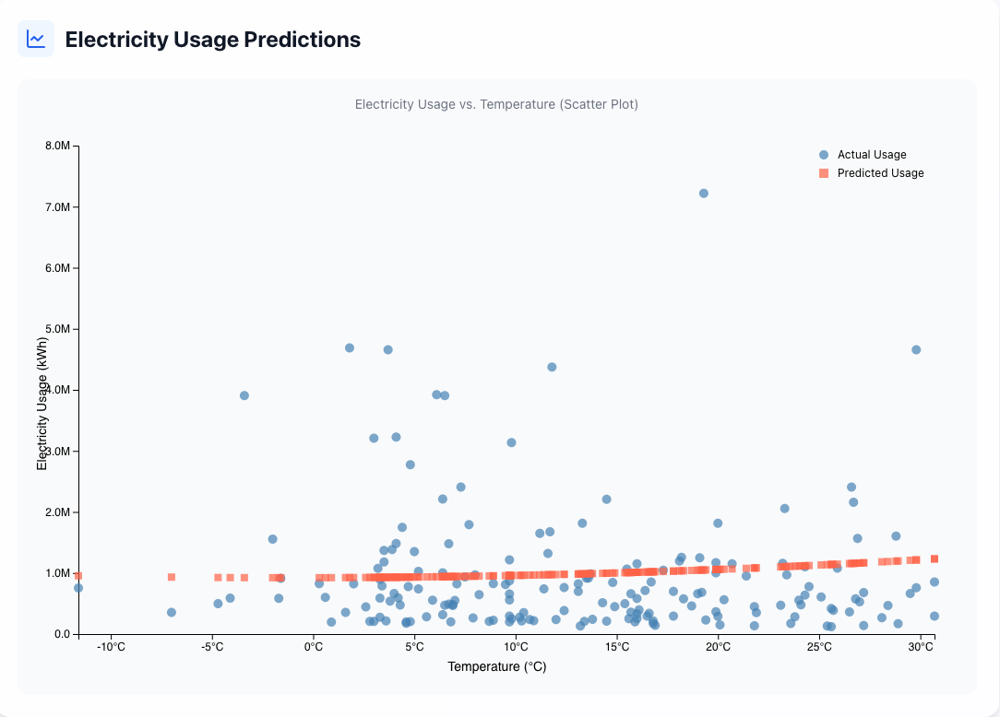
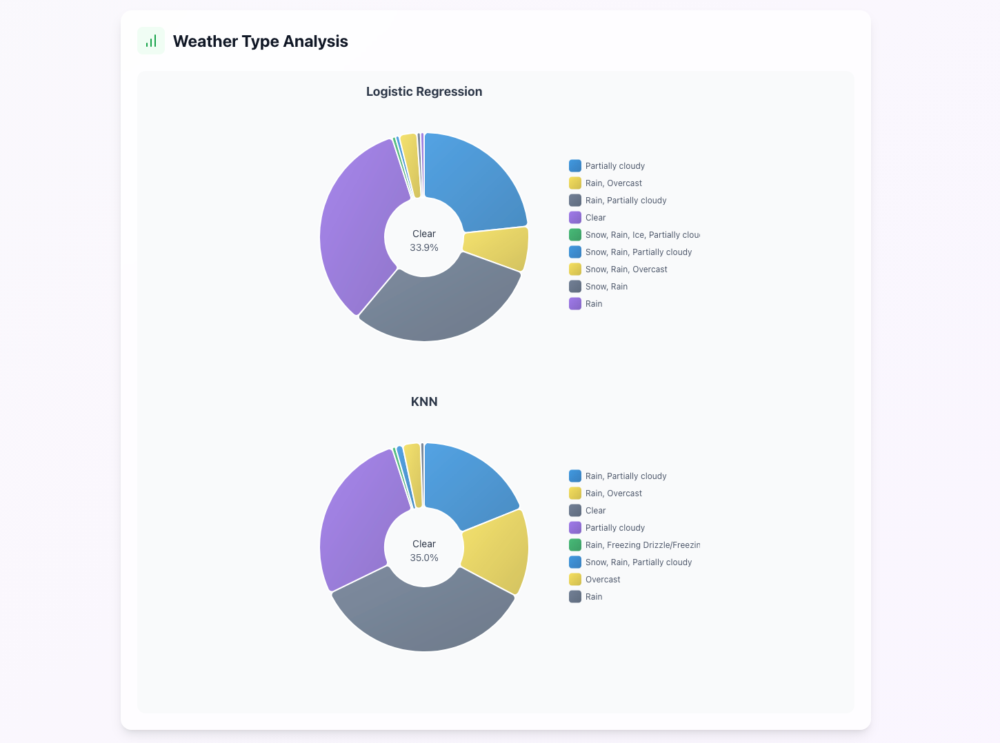

# Introduction
The Weather App Project is a web application designed to provide users with real-time weather updates and forecasts
for their chosen locations. Built with React and JavaScript, the app offers a user-friendly interface and leverages a third-party weather API to fetch accurate weather data.
# Technologies Used
- **React**: For building the user interface and managing state.
- **JavaScript**: The programming language used for implementing the app's functionality.
- **Tailwind CSS**: For styling the application and ensuring a responsive design.
- **Weather API**: A third-party API used to fetch weather data based on user input.
# My Journey (Problems we faced and what I learned)

